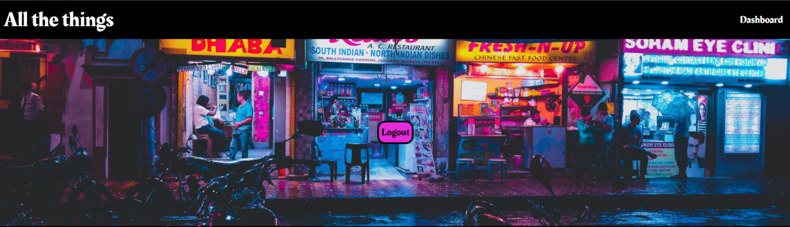
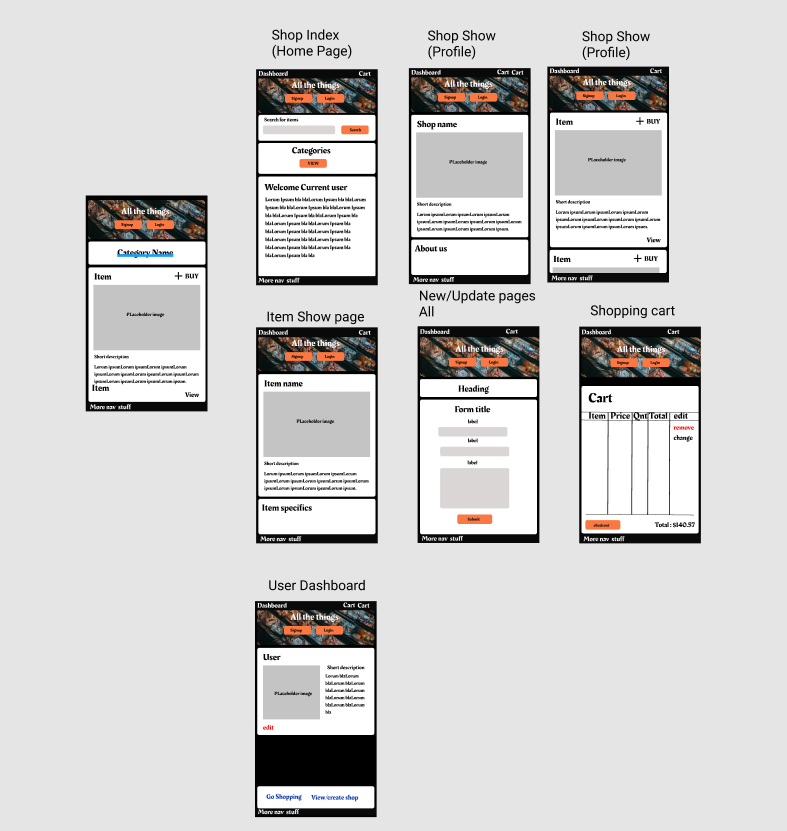
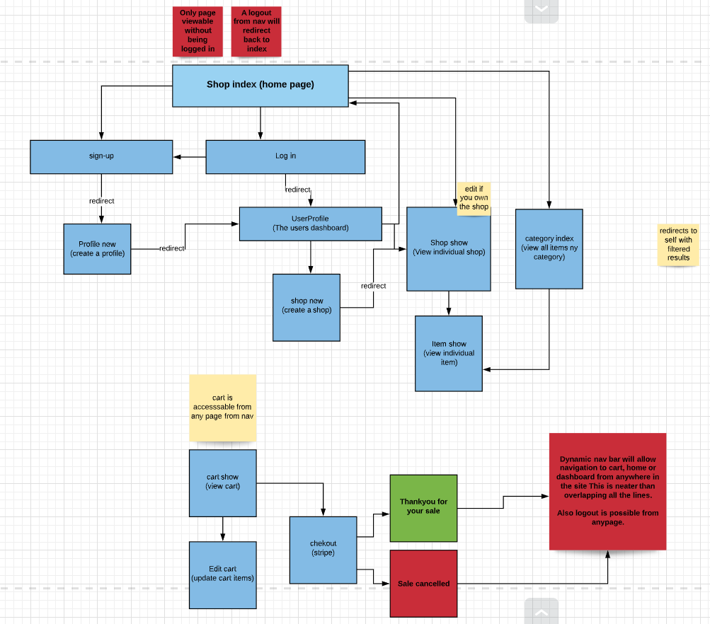
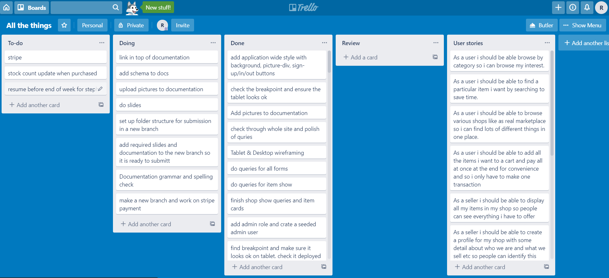
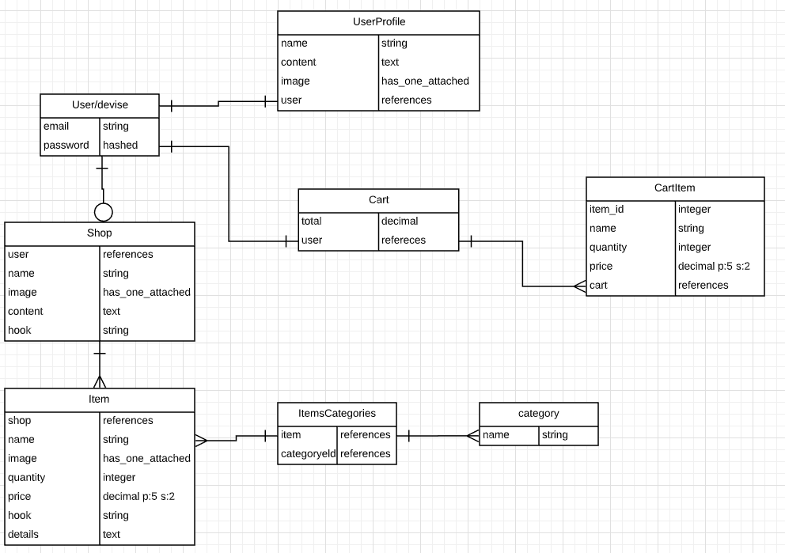

<h1>All The Things</h1>

**Site links**
- https://powerful-tundra-28686.herokuapp.com/
- https://github.com/Roakz/all-the-things

<h3>Contents</h3>

1. **Purpouse**

2. **Functionality & features**
-	Functionality
-	Key Features
-	Tech Stack
3. **Planning**
-   sitemap
-   Trello board
-	user stories
-	wireframes/mock-ups
-   ERD attachment
4. **Database**
-	database-schema attachment
5. **Attached presentation slide deck**

___

<h2>1. Purpose</h2>
All the Things is being developed to meet the criteria of creating a 2 sided marketplace app for an assignment I am completing at Coder Academy. The purpose is to handle the app from design to deployment in the rails domain. It will be developed with the intention to create an online domain where a user can purchase all the things! for an absolute bargain!!....why ? Because we need all the things! :D. The target audience is people selling goods and people wanting to buy them.
___

<h2>2.Functionality & Features</h2>

<h3>Functionality</h3>

All the things will be a fullly funtioning 2 sided market place app. A user will be able to browse shops on the main home page which will be layed out on individual cards to create a dynamic design. If they want to see more they simply click into the shop. Here they can view the shop profile and items its selling. If they want to buy items they can add it to the cart and then checkout once they are done shopping. User will also be directed to create a profile upon signing up for an account.

From a sellers point of view you will be able to create a Shop which will have a profile. Any user can do this. Within that shop you can add as many items as you wish which will be listed in your shop and on the category browse page. Users will be able to view your shop and all items in it if they click into your particular store. 

<h3>Features</h3>

**The main features of All The Things will include:**

**- A user sign up/in**
This will Assist with authorisation aswell as authenticaiton.
**- A shopping cart**
To improve user experience and keep them shopping for all the great bargains!
**- A checkout**
This will ensure the seller can accept funds and that we can take our cut.
**- Search bar**
A simple search bar to search listed items
**- Category Page**
A dynamically generated category listing page with the Categories of currently listed items and items listed under their categories.

<h3>Tech stack</h3>

This apps back end funcionality will be developed using The rails Framework stacked on the Ruby language. The styling will be done using SCSS for some basic CSS styling and HTML for the main page layouts. 

Postgresql will be used for the database utilising a relational data moddel and this will tie in nicely with deploying on Heroku as it supports this structure in a relativley easy manner to deploy right from terminal. Im planning on deploying fairly early to avoid late deployment issues. Pretty much as soon as i have finished the mobile layouts.

**Gems**

**The Gems used will be as follows:**
**Devise -** User Authentication
**Rolify -** Authorisations
**Cloudify -** Image attachment using with the Active Storage Unit of rails.
**Stripe -** Payment checkout

**Third party API**

As you may have figured from above third party API's will be used fin the development of this app.

**cloudify**

Cloudify provides a third party cloud image and fiole hosting service. They have a well documented api that doesnt require much setup. Just some encrypting of API keys and installation of there gems which work in nicely with ActiveStorage in Rails. It provides not only storage but some great image manipulation options aswell.

**Stripe -**

Stripe is a proffesional full-package checkout system API for accepting customer payment. You can sign up to a dashboard account and it will even provide testing keys for the development environment. They are PCI approved which means that we dont have to be. As we will not be storing any credit card details on any of our database. Stripe is extremly heavily documented making most requirements well accessable to the average dev. or Junior like me :P. 

Stripe API has many options including one off, subscriptions and even splitting payment and fees for fullscale market place sites that require payment to go to the sellers aswell.

___

<h2>3.Planning</h2>

All aspects of the app will be planned out before writing code to ensure a structured and focused approach. I will Use Trello to assit in Managing the flow of the project and to keep things focused.

The app will be deisgned Mobile first with responsiveness in mind for optimal user experience. Plus lets face it !! everyone uses there phones for this stuff nowdays!!

I will start with This documentation to help focus my thoughts and ideas and then finish them of upon completion/as i go when needed.

Moving on from here i will complete some mood boarding on pintrest to help focus my design ideas and color schemes and then complete some mock-ups and wireframes so that the front end is ready to be coded upon completion of the main back-end funtionality.

I will then complete An ERD entity relational diagram. This will map out the required database structure and the required associations between them. This will essentially help visualize what models will be required for the app.

Also a sitemap will go hand in hand with this.

**Pictures of the Above**

**Mock-ups/Wireframes**

**Sitemap**

**Trello Project Management**

**ERD**

<h2>4.Database</h2>

The app contains a relational database system using postgresql and rails to create the appropriate migragtions of database queries. One of the great things about rails with postgresql is that it will generate the required migrations holding the appropriate queries in it & create our database schema. 

The general flow and relationships or associations if you will are demonstrated in the ERD above. But basically there will be a User model which Has one profile and cart(shopping cart). The cart can have many cart-items which will form the order to be passed to stripe.Cart items will be destroyed upon a succesfull sale. The user can be both a buyer and a seller if they want. So the User can create 1 shop meaning the User can have 1 shop(has_one). From here a shop has many items (has_many). All of these items will therefore be created through a user which is important to know for routing purpouses.

An item and a category share the only required many to many relationship of the app an item can have many categories and a categroy can have many items. For this I will use a joining table called ItemsCategories which will hold the ids for both and form the many to many relationship between them.

Also worth metioning is that although our cart items will be using information directly from our items they are in no way actually related and i figures its just as easy to pass the item id through with the add item form so that all the required details are avaible in the controller. 

**Any Feedback always Appreciated**

